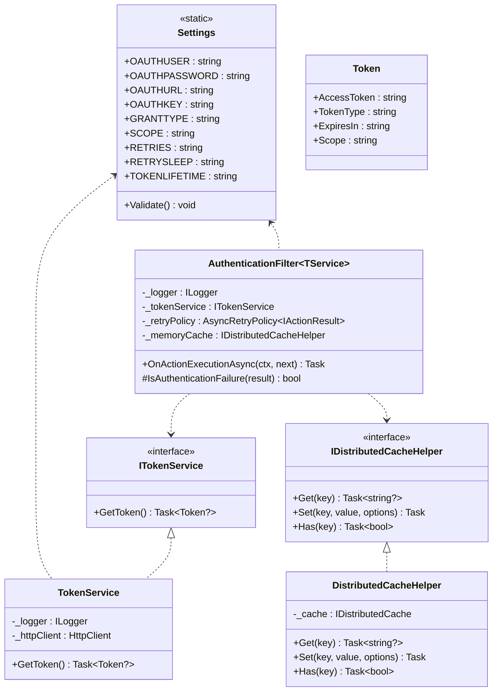
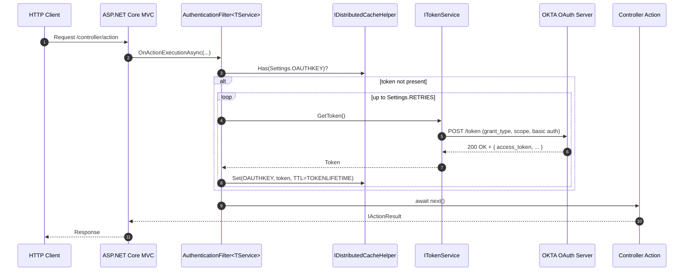
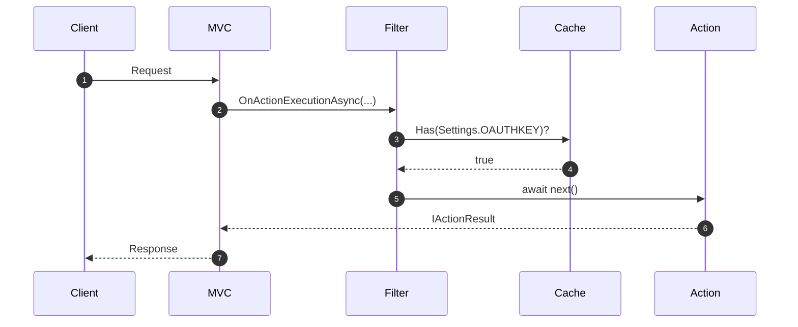
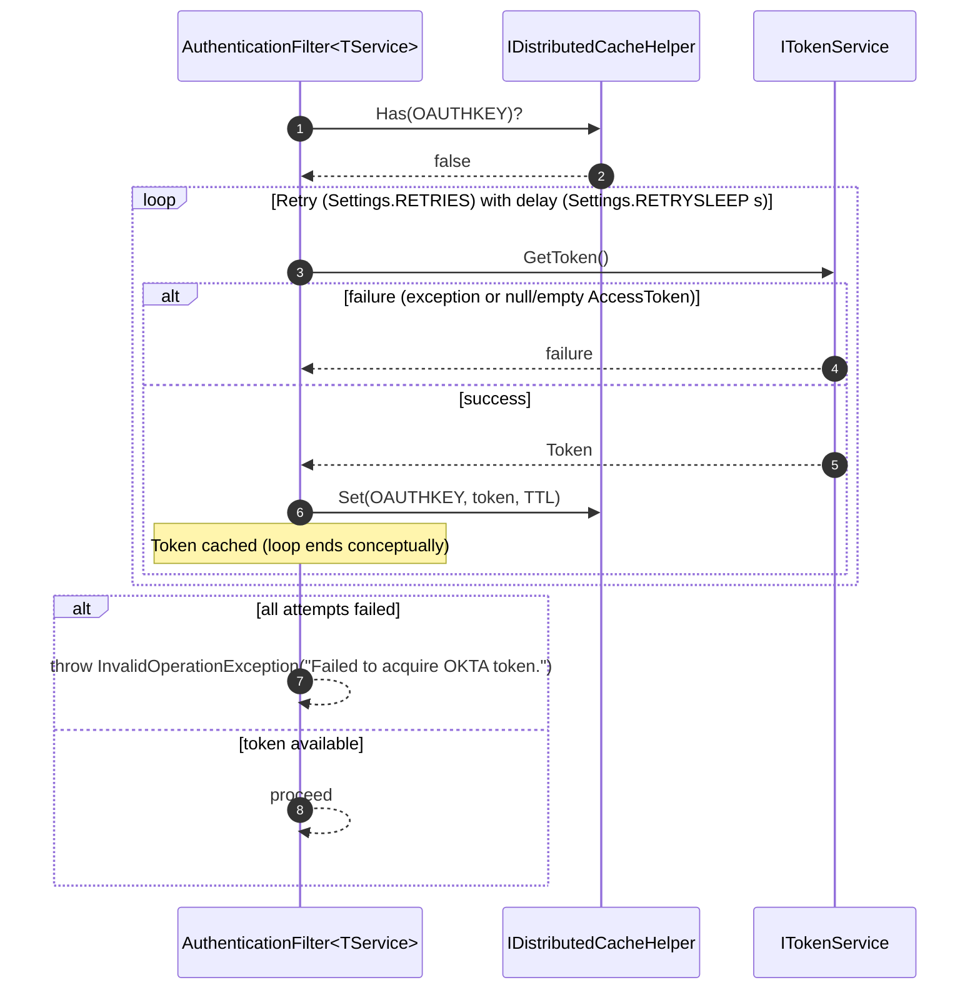

# Maurer.OktaFilter

> Seamless acquisition, application, and storage of OKTA security tokens for OKTA-dependent services with minimal impact.

[](https://github.com/john-maurer/Maurer.OktaFilter/actions/workflows/build.yml)
[](https://www.nuget.org/packages/Maurer.OktaFilter/)
[](https://www.nuget.org/packages/Maurer.OktaFilter/)

[](LICENSE)

## Table of Contents

- [Intent](#intent)
- [Dependencies](#dependencies)
- [Why use it?](#why-use-it)
- [When to Use](#when-to-use)
- [Components](#components)
- [Interactions](#interactions)
- [Outcomes](#outcomes)
- [Implementation Guide](#implementation-guide)
  - [1. Configure Secrets in Azure Key Vault and Export to Azure Configuration Services](#1-configure-secrets-in-azure-key-vault-and-export-to-azure-configuration-services)
  - [2. Install the Package](#2-install-the-package)
  - [3. Configure Settings](#3-configure-settings)
  - [4. Configure DI in Startup](#4-configure-di-in-startup)
  - [Using the Filter in a Controller](#using-the-filter-in-a-controller)
  - [Alternative Caching Providers](#alternative-caching-providers)
    - [Redis Cache](#redis-cache)
    - [SQL Server Cache](#sql-server-cache)
    - [Distributed SQL Server Cache (using Entity Framework)](#distributed-sql-server-cache-using-entity-framework)

---

## Intent

This library aims to provide a seamless solution for acquiring, applying, and storing OKTA security tokens for OKTA token dependant services with minimal impact.

---

## Dependencies

- **.NET**: 8 or 9
- **NuGet packages** (from the project file)
  - Microsoft.AspNetCore.Mvc (2.3.0)
  - Microsoft.Extensions.Caching.Abstractions (9.0.9)
  - Microsoft.Extensions.Configuration.Abstractions (9.0.9)
  - Microsoft.Extensions.Logging.Abstractions (9.0.9)
  - Newtonsoft.Json (13.0.4)
  - Polly (8.6.4)

```xml
<Project Sdk="Microsoft.NET.Sdk">
  <PropertyGroup>
    <TargetFrameworks>net8.0;net9.0</TargetFrameworks>
    <ImplicitUsings>enable</ImplicitUsings>
    <Nullable>enable</Nullable>
    <TreatWarningsAsErrors>false</TreatWarningsAsErrors>
  </PropertyGroup>
  <ItemGroup>
    <PackageReference Include="Microsoft.AspNetCore.Mvc" Version="2.3.0" />
    <PackageReference Include="Microsoft.Extensions.Caching.Abstractions" Version="9.0.9" />
    <PackageReference Include="Microsoft.Extensions.Configuration.Abstractions" Version="9.0.9" />
    <PackageReference Include="Microsoft.Extensions.Logging.Abstractions" Version="9.0.9" />
    <PackageReference Include="Newtonsoft.Json" Version="13.0.4" />
    <PackageReference Include="Polly" Version="8.6.4" />
  </ItemGroup>
</Project>
```

---

## Why use it?

- **Cost & Performance** — cache and reuse access tokens across requests to reduce OKTA traffic and latency.
- **Resilience** — configurable retry policy (via Polly) for 401/403/407 scenarios during token acquisition.
- **Ergonomics** — drop-in `IAsyncActionFilter` that hides the handshake; controllers stay focused on domain logic.
- **DI-friendly** — clean interfaces (`ITokenService`, `IDistributedCacheHelper`) make testing and swapping easy.
- **Security-conscious** — token service enforces HTTPS and typed parsing.
- **Pluggable storage** — works with in-memory, Redis, or SQL Server distributed cache.
- **Observability** — structured logging around token retrieval and retries.

---

## When to Use

- Calling APIs that **require OKTA authentication** and you want to centralize the handshake.
- You need to **share tokens across requests/services** to control costs.
- You want **built-in retries** for transient auth failures (401/403/407).
- You prefer a **controller-level filter** over middleware for per-endpoint control.
- You need **cache-provider flexibility** (in-memory/Redis/SQL Server) via `IDistributedCache`.

---

## Components

1. **DistributedCacheHelper**  
   A DistributedCache wrapper that abstracts usage and facilitates unit testing.

2. **TokenService**  
   Responsible for retrieving the OKTA token.

3. **AuthenticationFilter\<TokenService\>**  
   `IAsyncActionFilter` implementation encapsulating the token service and retry logic for refreshes and retries.

4. **Settings**  
   Static configuration values (OAuth credentials, retry policy, key name, token lifetime, grant type, scope).

5. **Token (model)**  
   Simple POCO (`access_token`, `token_type`, `expires_in`, `scope`).

---

## Interactions

### Class relationships



### Sequence — request with cache miss (token acquired then proceed)



### Sequence — request with cache hit (no network call)



### Sequence — acquisition retry and failure (high level)



---

## Outcomes

## Outcomes

- **Lower cost & latency** — tokens are cached and reused across requests (and across instances with a distributed cache), reducing round-trips to OKTA.
- **Resilience by default** — transient auth failures (401/403/407) are retried using Polly; retry count and delay are controlled via `Settings.RETRIES` and `Settings.RETRYSLEEP`.
- **Predictable expiration** — cache entries honor `Settings.TOKENLIFETIME`; a new token is acquired automatically on cache miss or expiry.
- **Simple composition** — the `IAsyncActionFilter` encapsulates the handshake so controllers stay focused on business logic; everything is wired via DI.
- **Pluggable storage** — works with in-memory, Redis, or SQL Server distributed cache behind `IDistributedCache`.
- **Security baseline** — `TokenService` enforces HTTPS token endpoints and uses typed JSON parsing; scopes and grant type are explicit via settings.
- **Observability** — structured logging around token retrieval attempts, outcomes, and retry cycles to aid diagnostics across environments.
- **Environment-friendly** — settings map cleanly from configuration providers (Key Vault, appsettings, env vars) for dev, staging, and prod.

---

## Implementation Guide

### 1. Configure Secrets in Azure Key Vault and Export to Azure Configuration Services

Add three elements to your Azure Key Vault:

- `OAUTH-PASSWORD`  
- `OAUTH-URL`  
- `OAUTH-USER`

You'll need to acquire a valid oauth user name, password and URL from your organization.

### 2. Install the Package

1. Right-click on your project and select **Manage NuGet Packages…**  
2. Change your Package Source to **Nuget** (https://nuget/v3/index.json).  
3. Go to the **Browse** tab.  
4. In the search bar, type **Maurer.OKTAFilter** and install the latest package.

### 3. Configure Settings

Use the static `Settings` object properties to configure the filter and how OKTA tokens are managed:

- **OAUTHUSER** – Authorized user/principle ID  
- **OAUTHPASSWORD** – Password associated with user/principle ID  
- **OAUTHURL** – Your organization's [OKTA URL](https://developer.okta.com/docs/guides/find-your-domain/main/).  
- **OAUTHKEY** – The KEY value associated with your OKTA key (examples will use _OKTA-TOKEN_).  
- **RETRIES** – The number of attempts the filter should make to acquire an OKTA token.  
- **RETRYSLEEP** – The number in seconds to wait in between retry attempts.  
- **TOKENLIFETIME** – The lifetime in minutes of the OKTA token, should not exceed 55 minutes.  
- **GRANTTYPE** – The OAuth2 grant type (e.g., `client_credentials`, `authorization_code`, etc.).  
- **SCOPE** – The permissions requested when obtaining an access token. See [Scopes](https://learn.microsoft.com/en-us/entra/identity-platform/scopes-oidc).

### 4. Configure DI in Startup

Multiple methods exist for setting up your distributed cache. The simplest is an in-memory cache for local caching within the same application instance.

```csharp
using Maurer.OktaFilter;
using Maurer.OktaFilter.Interfaces;
using Maurer.OktaFilter.Helpers;
using Maurer.OktaFilter.Services;

// ...

// Inject caching
services.AddMemoryCache();
services.AddDistributedMemoryCache();

// Inject the distributed cache helper
services.AddSingleton<IDistributedCacheHelper, DistributedCacheHelper>();

// Inject the token service
services.AddHttpClient<ITokenService, TokenService>();

// Inject the action filter (closed generic)
services.AddScoped<AuthenticationFilter<Maurer.OktaFilter.Services.TokenService>>();
```

Alternative caching methods are detailed below.

### Alternative Caching Providers

#### Redis Cache

Redis can cache data across multiple applications and application instances on multiple servers, unlike just a single application instance.

Install the latest `Microsoft.Extensions.Caching.StackExchangeRedis` package and replace the following code from the previous example:

```csharp
// Inject caching
services.AddMemoryCache();
services.AddDistributedMemoryCache();
```

With this:

```csharp
services.AddStackExchangeRedisCache(options =>
{
    options.Configuration = "your-redis-connection-string";
});
```

Keep the helper registration:

```csharp
services.AddSingleton<IDistributedCacheHelper, DistributedCacheHelper>();
```

#### SQL Server Cache

Use the `sql-cache` tool to create a table for caching.

**Create the table:**
```bash
dotnet sql-cache create "Data Source=(localdb)/MSSQLLocalDB;Initial Catalog=DistCache;Integrated Security=True;" dbo MySuperRadCache
```

This produces a table called `MySuperRadCache` with the following schema:

| Name | Data Type | Allow Nulls |
| :-- | :-- | :-- |
| Id | nvarchar(499) | No |
| Value | varbinary(MAX) | No |
| ExpiresAtTime | datetimeoffset(7) | No |
| SlidingExpirationInSeconds | bigint | Yes |
| AbsoluteExpiration | datetimeoffset(7) | No |

**Register:**
```csharp
builder.Services.AddDistributedSqlServerCache(options =>
{
    options.ConnectionString = builder.Configuration.GetConnectionString("your-sql-connection-string");
    options.SchemaName = "dbo";
    options.TableName = "TestCache";
});
```

#### Distributed SQL Server Cache (using Entity Framework)

```csharp
services.AddDbContext<YourCacheDbContext>(options =>
{
    options.UseSqlServer("your-sql-connection-string");
});

services.AddDistributedSqlServerCache(options =>
{
    options.ConnectionString = "your-sql-connection-string";
    options.SchemaName = "dbo";
    options.TableName = "TestCache";
});
```

---

## Using the Filter in a Controller

Add the Filter to the Controller (via `ServiceFilter` or `TypeFilter`):

```csharp
using Maurer.OktaFilter;
using Maurer.OktaFilter.Interfaces;

[ApiController]
[Route("mine")]
[ServiceFilter(typeof(AuthenticationFilter<Maurer.OktaFilter.Services.TokenService>))]
public class MyController : ControllerBase
{
    private readonly IConfiguration _configuration;
    private readonly ILogger<MyController> _logger;
    private readonly IDistributedCacheHelper _memoryCache;

    public MyController(ILogger<MyController> logger, IConfiguration configuration, IDistributedCacheHelper memoryCache)
    {
        _logger = logger;
        _configuration = configuration;
        _memoryCache = memoryCache;
    }

    // actions...
}
```

### Extracting the Token

**As a Token object**
```csharp
var tokenResponse = JsonConvert.DeserializeObject<Token>
    ((await _memoryCache.Get(Maurer.OktaFilter.Settings.OAUTHKEY))!);
```

**Just the token string**
```csharp
var token = JsonConvert.DeserializeObject<Token>
    ((await _memoryCache.Get(Maurer.OktaFilter.Settings.OAUTHKEY))!).AccessToken;
```
