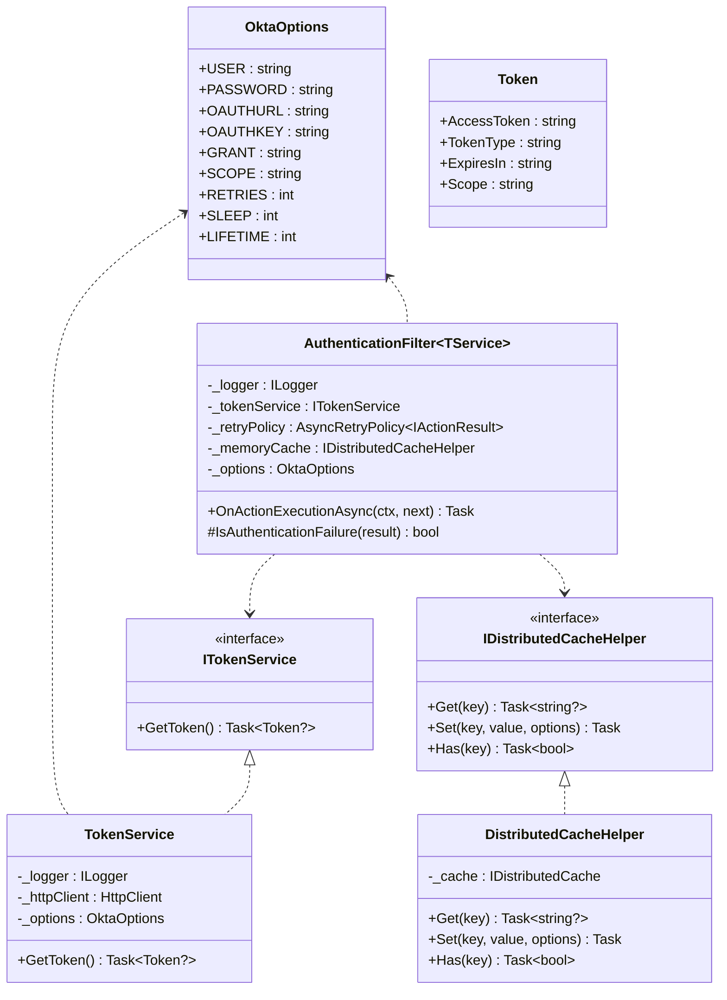
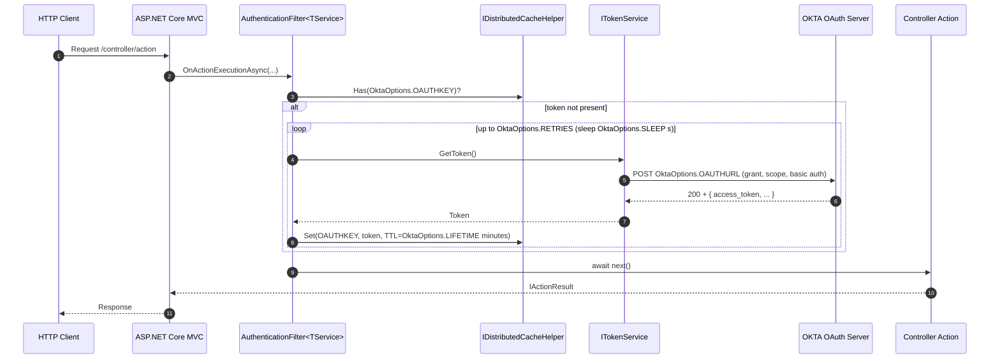
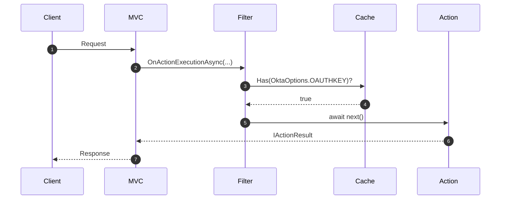
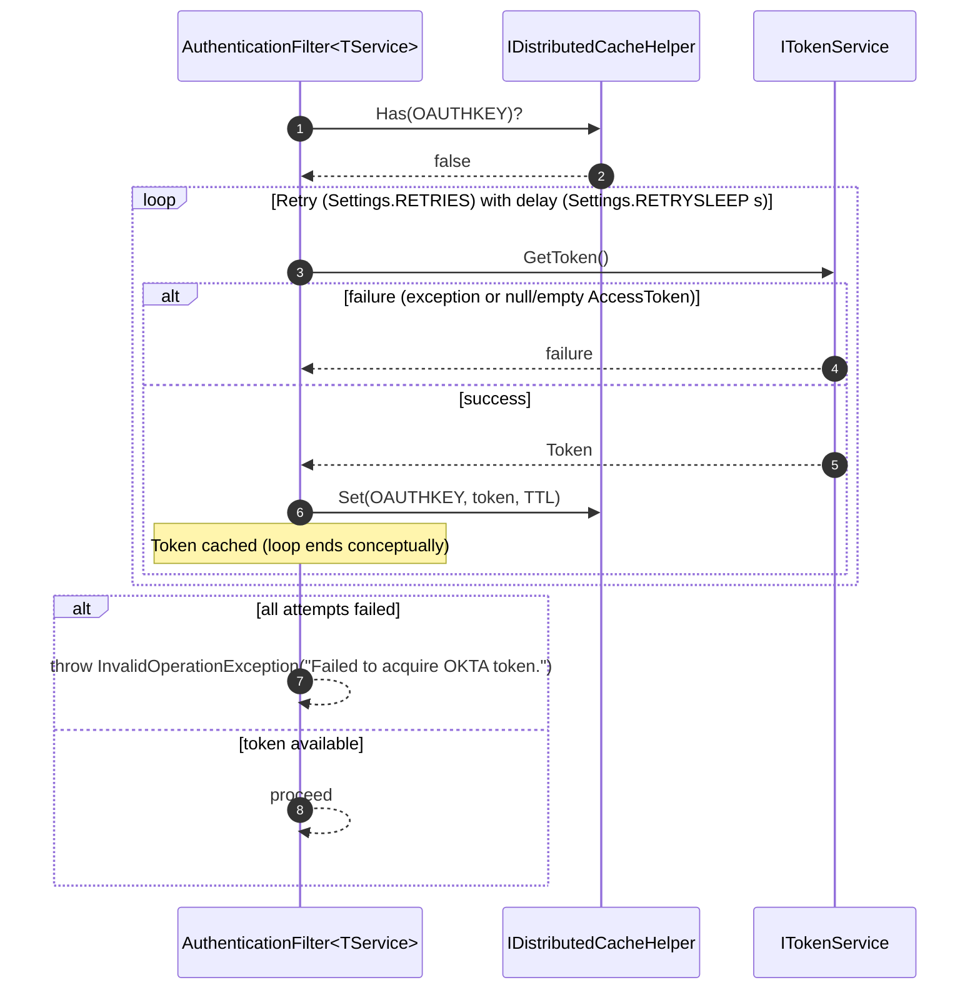

# Maurer.OktaFilter

> Seamless acquisition, application, and storage of OKTA security tokens for OKTA-dependent services with minimal impact.

[](https://github.com/john-maurer/Maurer.OktaFilter/actions/workflows/build.yml)
[](https://www.nuget.org/packages/Maurer.OktaFilter/)
[](https://www.nuget.org/packages/Maurer.OktaFilter/)

[](LICENSE)

## Table of Contents

- [Intent](#intent)
- [Dependencies](#dependencies)
- [Why use it?](#why-use-it)
- [When to Use](#when-to-use)
- [Components](#components)
- [Interactions](#interactions)
  - [Class relationships](#class-relationships)
  - [Sequence — request with cache miss (token acquired then proceed)](#sequence--request-with-cache-miss-token-acquired-then-proceed)
  - [Sequence — request with cache hit (no network call)](#sequence--request-with-cache-hit-no-network-call)
  - [Sequence — acquisition retry and failure (high level)](#sequence--acquisition-retry-and-failure-high-level)
- [Outcomes](#outcomes)
- [Implementation Guide](#implementation-guide)
  - [1. Configure Secrets in Azure Key Vault and Export to Azure Configuration Services](#1-configure-secrets-in-azure-key-vault-and-export-to-azure-configuration-services)
  - [2. Install the Package](#2-install-the-package)
  - [3. Configure Settings](#3-configure-settings)
    - [3.1 Configure Settings with Azure Key Vault (recommended for secrets)](#31-configure-settings-with-azure-key-vault-recommended-for-secrets)
      - [3.1.1: NuGet (in your app)](#311-nuget-in-your-app)
      - [3.1.2: Secret Naming Convention - Demonstration Purposes](#312-secret-naming-convention---demonstration-purposes)
      - [3.2.1: Step 1 - Dependencies](#321-step-1---dependencies)
      - [3.2.2: Step 2 - Read `keyvault` URI](#322-step-2---read-keyvault-uri)
      - [3.2.3: Step 3 - Bind `OktaOptions`](#323-step-3---bind-oktaoptions)
      - [3.2.4: Step 4 - Register OktaFilter](#324-step-4---register-oktafilter)
  - [4. Configure DI in Startup](#4-configure-di-in-startup)
    - [4.1 Minimal (In-Memory Cache, typed HttpClient, options bound)](#41-minimal-in-memory-cache-typed-httpclient-options-bound)
      - [4.1.1 Code-Only options (no `IConfiguration`)](#411-code-only-options-no-iconfiguration)
    - [4.2 Custom HttpClient (timeouts, decompression)](#42-custom-httpclient-timeouts-decompression)
    - [4.3 Redis Cache](#43-redis-cache)
    - [4.4 SQL Server Cache](#44-sql-server-cache)
    - [4.5 Distributed SQL Server Cache (using Entity Framework)](#45-distributed-sql-server-cache-using-entity-framework)
- [Using the Filter in a Controller](#using-the-filter-in-a-controller)
  - [Extracting the Token](#extracting-the-token)

---

## Intent

This library aims to provide a seamless solution for acquiring, applying, and storing OKTA security tokens for OKTA token dependant services with minimal impact.

---

## Dependencies

- **.NET**: 8 or 9
- **NuGet packages** (from the project file)
  - Microsoft.Extensions.Caching.Abstractions (9.0.9)
  - Microsoft.Extensions.Configuration.Abstractions (9.0.9)
  - Microsoft.Extensions.Logging.Abstractions (9.0.9)
  - Microsoft.Extensions.Http (9.0.9)
  - Newtonsoft.Json (13.0.4)
  - Polly (8.6.4)

```xml
<Project Sdk="Microsoft.NET.Sdk">
  <PropertyGroup>
    <TargetFrameworks>net8.0;net9.0</TargetFrameworks>
    <ImplicitUsings>enable</ImplicitUsings>
    <Nullable>enable</Nullable>
    <TreatWarningsAsErrors>false</TreatWarningsAsErrors>
  </PropertyGroup>
  <ItemGroup>
    <PackageReference Include="Microsoft.Extensions.Caching.Abstractions" Version="9.0.9" />
    <PackageReference Include="Microsoft.Extensions.Configuration.Abstractions" Version="9.0.9" />
    <PackageReference Include="Microsoft.Extensions.Logging.Abstractions" Version="9.0.9" />
    <PackageReference Include="Microsoft.Extensions.Http" Version="9.0.9" />
    <PackageReference Include="Newtonsoft.Json" Version="13.0.4" />
    <PackageReference Include="Polly" Version="8.6.4" />
  </ItemGroup>
</Project>
```

---

## Why use it?

- **Cost & Performance** — cache and reuse access tokens across requests to reduce OKTA traffic and latency.
- **Resilience** — configurable retry policy (via Polly) for 401/403/407 scenarios during token acquisition.
- **Ergonomics** — drop-in `IAsyncActionFilter` that hides the handshake; controllers stay focused on domain logic.
- **DI-friendly** — clean interfaces (`ITokenService`, `IDistributedCacheHelper`) make testing and swapping easy.
- **Security-conscious** — token service enforces HTTPS and typed parsing.
- **Pluggable storage** — works with in-memory, Redis, or SQL Server distributed cache.
- **Observability** — structured logging around token retrieval and retries.

---

## When to Use

- Calling APIs that **require OKTA authentication** and you want to centralize the handshake.
- You need to **share tokens across requests/services** to control costs.
- You want **built-in retries** for transient auth failures (401/403/407).
- You prefer a **controller-level filter** over middleware for per-endpoint control.
- You need **cache-provider flexibility** (in-memory/Redis/SQL Server) via `IDistributedCache`.

---

## Components

1. **DistributedCacheHelper**  
   Wrapper over `IDistributedCache` with convenience methods for strings/JSON and easy unit testing.

2. **TokenService**  
   Retrieves the OKTA token over HTTPS. Pluggable via DI/HttpClient.

3. **AuthenticationFilter\<TokenService\>**  
   `IAsyncActionFilter` that ensures a token is cached before the action executes; retries acquisition via Polly as configured.

4. **OktaOptions**  
   Typed configuration object (user, password, token URL, cache key, grant, scope, retries/sleep, token lifetime).

5. **Token (model)**  
   Simple POCO (`access_token`, `token_type`, `expires_in`, `scope`).

---

## Interactions

### Class relationships



### Sequence — request with cache miss (token acquired then proceed)



### Sequence — request with cache hit (no network call)



### Sequence — acquisition retry and failure (high level)



---

## Outcomes

- **Lower cost & latency** — tokens are cached and reused across requests (and across instances with a distributed cache), reducing round-trips to OKTA.
- **Resilience by default** — transient auth failures (401/403/407) are retried using Polly; retry count and delay are controlled via `Settings.RETRIES` and `Settings.SLEEP`.
- **Predictable expiration** — cache entries honor `Settings.LIFETIME`; a new token is acquired automatically on cache miss or expiry.
- **Simple composition** — the `IAsyncActionFilter` encapsulates the handshake so controllers stay focused on business logic; everything is wired via DI.
- **Pluggable storage** — works with in-memory, Redis, or SQL Server distributed cache behind `IDistributedCache`.
- **Security baseline** — `TokenService` enforces HTTPS token endpoints and uses typed JSON parsing; scopes and grant type are explicit via settings.
- **Observability** — structured logging around token retrieval attempts, outcomes, and retry cycles to aid diagnostics across environments.
- **Environment-friendly** — settings map cleanly from configuration providers (Key Vault, appsettings, env vars) for dev, staging, and prod.

---

## Implementation Guide

### 1. Configure Secrets in Azure Key Vault and Export to Azure Configuration Services

Add three elements to your Azure Key Vault:

- `OAUTH-PASSWORD`  
- `OAUTH-URL`  
- `OAUTH-USER`

You'll need to acquire a valid oauth user name, password and URL from your organization.

### 2. Install the Package

1. Right-click on your project and select **Manage NuGet Packages…**  
2. Change your Package Source to **Nuget** (https://nuget/v3/index.json).  
3. Go to the **Browse** tab.  
4. In the search bar, type **Maurer.OKTAFilter** and install the latest package.

### 3. Configure Settings

Use the typed options `OktaOptions` to configure the filter and how OKTA tokens are managed:

- **OAUTHUSER** – Authorized user/principle ID  
- **OAUTHPASSWORD** – Password associated with user/principle ID  
- **OAUTHURL** – Your organization's [OKTA URL](https://developer.okta.com/docs/guides/find-your-domain/main/).  
- **OAUTHKEY** – The KEY value associated with your OKTA key (examples will use _OKTA-TOKEN_).
- **GRANT** – The OAuth2 grant type (e.g., `client_credentials`, `authorization_code`, etc.).
- **SCOPE** – The permissions requested when obtaining an access token. See [Scopes](https://learn.microsoft.com/en-us/entra/identity-platform/scopes-oidc).
- **RETRIES** – The number of attempts the filter should make to acquire an OKTA token.  
- **SLEEP** – The number in seconds to wait in between retry attempts.  
- **LIFETIME** – The lifetime in seconds of the OKTA token, should not exceed 55 minutes.

```json
{
  "Okta": {
    "USER": "client_id",
    "PASSWORD": "client_secret",
    "OAUTHURL": "https://your-okta-domain/oauth2/v1/token",
    "OAUTHKEY": "OKTA-TOKEN",
    "GRANT": "client_credentials",
    "SCOPE": "openid profile email",
    "RETRIES": 2,
    "SLEEP": 1,
    "LIFETIME": 30
  }
}
```

#### 3.1 Configure Settings with Azure Key Vault (recommended for secrets)

Azure Key Vault can be used to store `OktaOptions` values.

##### 3.1.1: NuGet (in your app)

* `Azure.Identity`
* `Azure.Security.KeyVault.Secrets`
* `Azure.Extensions.AspNetCore.Configuration.Secrets`

##### 3.1.2: Secret Naming Convention - Demonstration Purposes

Key Vault secret names map to configuration keys using -- as the section separator. So, `Okta:USER ⇒ Okta--USER`, `Okta:PASSWORD ⇒ Okta--PASSWORD`, etc.  

Add to your `keyvault` values to the **OKTA** secrets.

```bash
az keyvault secret set --vault-name <vault> --name Okta--USER --value <client_id>
az keyvault secret set --vault-name <vault> --name Okta--PASSWORD --value <client_secret>
az keyvault secret set --vault-name <vault> --name Okta--OAUTHURL --value https://your-okta-domain/oauth2/v1/token
az keyvault secret set --vault-name <vault> --name Okta--OAUTHKEY --value OKTA-TOKEN
az keyvault secret set --vault-name <vault> --name Okta--GRANT --value client_credentials
az keyvault secret set --vault-name <vault> --name Okta--SCOPE --value "openid profile email"
az keyvault secret set --vault-name <vault> --name Okta--RETRIES --value 2
az keyvault secret set --vault-name <vault> --name Okta--SLEEP --value 1
az keyvault secret set --vault-name <vault> --name Okta--LIFETIME --value 30
```

##### 3.2.1: Step 1 - Dependencies

The following Azure libraries are required:

```csharp
using Azure.Identity;
using Azure.Security.KeyVault.Secrets;
using Azure.Extensions.AspNetCore.Configuration.Secrets;

```

##### 3.2.2: Step 2 - Read `keyvault` URI

The `keyvault` URI can be read from an app setting or environment Variable.

```csharp
var keyVaultUri = builder.Configuration["KeyVaultUri"]; // e.g., "https://my-vault.vault.azure.net/"

if (!string.IsNullOrWhiteSpace(keyVaultUri))
{
    var client = new SecretClient(new Uri(keyVaultUri), new DefaultAzureCredential());
    builder.Configuration.AddAzureKeyVault(client, new KeyVaultSecretManager());
}
```

##### 3.2.3: Step 3 - Bind `OktaOptions`

Bind `OktaOptions` with `keyvault` values included.

```csharp
builder.Services.AddOptions<OktaOptions>()
    .Bind(builder.Configuration.GetSection("Okta"))
    .ValidateDataAnnotations()
    .Validate(options => Uri.TryCreate(options.OAUTHURL, UriKind.Absolute, out var u) && u.Scheme == Uri.UriSchemeHttps, "OAUTHURL must be an absolute HTTPS URL.")
    .ValidateOnStart();
```

##### 3.2.4: Step 4 - Register OktaFilter

Register OktaFilter as you prefer (cache choice is up to your app).

```csharp
builder.Services.AddOktaFilter(builder.Configuration, services =>
{
    services.AddDistributedMemoryCache(); //AddStackExchangeRedisCache/AddDistributedSqlServerCache
});
```

### 4. Configure DI in Startup

Multiple methods exist for setting up your distributed cache.  There are extensions for basic setup.  Alternative caching methods are detailed below.

#### 4.1 Minimal (In-Memory Cache, typed HttpClient, options bound)

The simplest is an in-memory cache for local caching within the same application instance.

```csharp
using Maurer.OktaFilter;
using Maurer.OktaFilter.Interfaces;
using Maurer.OktaFilter.Helpers;
using Maurer.OktaFilter.Services;
using Maurer.OktaFilter.Models;

// ...

// Bind and Validate in Startup/Program
builder.Services.AddOptions<OktaOptions>()
    .Bind(builder.Configuration.GetSection("Okta"))
    .ValidateDataAnnotations()
    .Validate(o => Uri.TryCreate(o.OAUTHURL, UriKind.Absolute, out var u) && u.Scheme == Uri.UriSchemeHttps, "OAUTHURL must be an absolute HTTPS URL.")
    .ValidateOnStart();

// Inject caching
services.AddMemoryCache();
services.AddDistributedMemoryCache();

// Inject the distributed cache helper
services.AddSingleton<IDistributedCacheHelper, DistributedCacheHelper>();

// Inject the token service
services.AddHttpClient<ITokenService, TokenService>();

// Inject the action filter (closed generic)
services.AddScoped<AuthenticationFilter<TokenService>>();
```

##### 4.1.1 Code-Only options (no `IConfiguration`)

Even more minimal.

```csharp
builder.Services.AddSingleton(new OktaOptions { /* fill fields */ });
builder.Services.AddDistributedMemoryCache();
builder.Services.AddSingleton<IDistributedCacheHelper, DistributedCacheHelper>();
builder.Services.AddHttpClient<ITokenService, TokenService>();
builder.Services.AddScoped<AuthenticationFilter<Maurer.OktaFilter.Services.TokenService>>();
```

#### 4.2 Custom HttpClient (timeouts, decompression)

Customized Client and Message Handler:

```csharp
builder.Services.AddHttpClient<ITokenService, TokenService>(client =>
{
    client.Timeout = TimeSpan.FromSeconds(15);
})
.ConfigurePrimaryHttpMessageHandler(() => new SocketsHttpHandler
{
    AutomaticDecompression = System.Net.DecompressionMethods.GZip | System.Net.DecompressionMethods.Deflate
});

builder.Services.AddSingleton<IDistributedCacheHelper, DistributedCacheHelper>();
builder.Services.AddDistributedMemoryCache();
builder.Services.AddScoped<AuthenticationFilter<Maurer.OktaFilter.Services.TokenService>>();
```

#### 4.3 Redis Cache

Redis can cache data across multiple applications and application instances on multiple servers, unlike just a single application instance.

Install the latest `Microsoft.Extensions.Caching.StackExchangeRedis` package and replace the following code from the previous example:

```csharp
// Inject caching
services.AddMemoryCache();
services.AddDistributedMemoryCache();
```

With this:

```csharp
services.AddStackExchangeRedisCache(options =>
{
    options.Configuration = "your-redis-connection-string";
});
```

Keep the helper registration singleton:

```csharp
services.AddSingleton<IDistributedCacheHelper, DistributedCacheHelper>();
```

As well as the calls to AddHttpClient and AddScoped:

```csharp
// Inject the token service
services.AddHttpClient<ITokenService, TokenService>();

// Inject the action filter (closed generic)
services.AddScoped<AuthenticationFilter<TokenService>>();
```

#### 4.4 SQL Server Cache

Use the `sql-cache` tool to create a table for caching.

**Create the table:**
```bash
dotnet sql-cache create "Data Source=(localdb)/MSSQLLocalDB;Initial Catalog=DistCache;Integrated Security=True;" dbo MySuperRadCache
```

This produces a table called `MySuperRadCache` with the following schema:

| Name | Data Type | Allow Nulls |
| :-- | :-- | :-- |
| Id | nvarchar(499) | No |
| Value | varbinary(MAX) | No |
| ExpiresAtTime | datetimeoffset(7) | No |
| SlidingExpirationInSeconds | bigint | Yes |
| AbsoluteExpiration | datetimeoffset(7) | No |

**Register:**

```csharp
builder.Services.AddDistributedSqlServerCache(options =>
{
    options.ConnectionString = builder.Configuration.GetConnectionString("your-sql-connection-string");
    options.SchemaName = "dbo";
    options.TableName = "TestCache";
});
```

#### 4.5 Distributed SQL Server Cache (using Entity Framework)

```csharp
services.AddDbContext<YourCacheDbContext>(options =>
{
    options.UseSqlServer("your-sql-connection-string");
});

services.AddDistributedSqlServerCache(options =>
{
    options.ConnectionString = "your-sql-connection-string";
    options.SchemaName = "dbo";
    options.TableName = "TestCache";
});
```

---

## Using the Filter in a Controller

Add the Filter to the Controller (via `ServiceFilter` or `TypeFilter`):

```csharp
using Maurer.OktaFilter;
using Maurer.OktaFilter.Interfaces;
using Maurer.OktaFilter.Services;
using Microsoft.Extensions.Caching.Distributed;

[ApiController]
[Route("mine")]
[ServiceFilter(typeof(AuthenticationFilter<TokenService>))]
public class MyController : ControllerBase
{
    private readonly IDistributedCacheHelper _memoryCache;
    private readonly IConfiguration _options_;
    private readonly ILogger<MyController> _logger;

    public MyController(IDistributedCacheHelper memoryCache, IOptions<OktaOptions> options, ILogger<MyController> logger)
    {
        _memoryCache = memoryCache;
        _options = options
        _logger = logger;
    }

    // actions...
}
```

### Extracting the Token

**As a Token object**
```csharp
var tokenResponse = JsonConvert.DeserializeObject<Token>
    ((await _memoryCache.Get(_options.OAUTHKEY))!);
```

**Just the token string**
```csharp
var token = JsonConvert.DeserializeObject<Token>
    ((await _memoryCache.Get(_options.OAUTHKEY))!).AccessToken;
```
